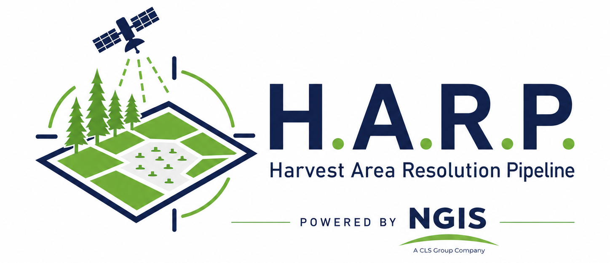

# HARP — Harvest Area Resolution Pipeline

HARP aggregates likely harvest areas associated with timber log and wood chip purchases by Harmac Pacific.

Where possible, it resolves purchases using primary government and other authoritative records, including forest tenure, harvest, timber mark, and parcel data.

Where direct resolution is not possible, HARP uses known operating or supply areas and HLS-DIST change detection to identify likely harvest activity within the relevant area and time period.

The resulting geometries are attributed, consolidated, cleaned, and validated for EUDR geolocation requirements.

---

## Outputs

### Monthly

Each run writes to its own folder under `data/outbox`, named for the month and
the run:

    2026-07_run-114328/
      run.log                     everything, in order
      summary.txt                 what came out, and what is outstanding
      1-resolved/                 resolution.csv and the split geometry
      2-detection/                what was submitted, and what came back
      3-month/                    the consolidated month

Runs are kept. They can be removed by hand.

| File | Description |
|---|---|
| `3-month/harvest-YYYY-MM.geojson` | Consolidated harvest geometry for the month, including precision tier, traceability method, and supporting attributes |
| `1-resolved/resolution.csv` | One row per supply source showing how it was resolved |
| `run.log` | Processing log for the run |

### Production lot

| File | Description |
|---|---|
| `lot-<id>.geojson` | Harvest areas that may have contributed fibre to the production lot |
| `lot-walkback-*.csv` | Delivery records included in the lot walkback and the period covered |

---

## Entry points

HARP can be run from the command line using:

    harp <command>

or:

    python -m harp <command>

### Main commands

| Command | Purpose |
|---|---|
| `harp run <drop> --month YYYY-MM` | Process a complete monthly client data package |
| `harp library` | Review staged and approved monthly datasets |
| `harp lot <lot list>` | Resolve production lots back to contributing deliveries and harvest areas |
| `harp areas` | Manage manually supplied operating and search areas |
| `harp supply` | What arrived in a month, and how much of it can be placed |
| `harp species` | Species on an existing month, without running everything else |
| `harp gaps` | Estimate what the services could not answer |
| `harp deliver` | The four EUDR fields and nothing else, for sending out |
| `harp mills` | Manage supplier mill locations and districts |

### Resuming a run

If a run reaches the detection stage but does not receive a result, it can resume without repeating the earlier resolution stages.

| Command | Purpose |
|---|---|
| `harp detect --month YYYY-MM` | Resume at change detection |
| `harp enrich <detections>` | Resume attribution using an existing detection result |
| `harp union` | Build the detection submission polygon without sending it |

### Other commands

`harp summary`, `harp runs`, `harp package`, `harp resolve`, `harp register`,
`harp ften`, `harp forget-parcels`

---

## Desktop interface

Launch with:

    python tools/harp_gui.py

The interface contains four tabs:

**The month**, **Library**, **Lots**, and **Setup**.

The Month tab runs the complete monthly pipeline and reports the status of each stage. If processing stops, the interface identifies where it stopped without requiring the user to inspect the run log.

---

## Investigation tools

The `tools/` directory contains utilities for investigation and troubleshooting outside the normal pipeline.

These include:

- supplier-to-tenure matching: `c2_probe.py`, `ften_candidates.py`, `aliases.py`
- Washington Forest Practices queries: `fpars_*.py`, `fpa_probe.py`
- private timber mark investigation: `ptm_*.py`
- direct detection API testing: `dist_api_test.py`

---

## Monthly workflow

A typical monthly run is:

    harp run ./data/inbox/2026-07 --month 2026-07

### 1. Sort

Incoming files are identified by their column structure rather than their filenames.

This is intentional. Source filenames have proven inconsistent and are not treated as reliable identifiers.

### 2. Resolve

Each supply source is passed through an ordered series of resolution methods. The first method that produces usable geometry is retained.

Examples include:

- a BC timber mark resolving to a cut block;
- a private timber mark resolving to the titled parcel from which it was scaled;
- a supplier resolving to forest tenure held by that company; or
- a Washington supplier resolving to registered Forest Practices applications.

### 3. Establish search areas

Sources that cannot be resolved directly are assigned the most specific reasonable geographic search area available.

Depending on the source, this may include:

- a known supplier operating area;
- a Natural Resource District;
- a county;
- a national forest; or
- another manually defined supply area.

Where no usable geographic boundary is available, no geometry is created and the source is recorded as unresolved.

### 3b. Producer-declared areas

Where the drop contains harvest areas a producer exported themselves, they are
read here and join the resolved geometry. They need no search area and no
detection.

Files are recognised by their structure rather than their supplier, and they
are deduplicated: one batch held 1,450 features and 370 distinct ones, because
a block feeding several booms is exported once per boom. Longitude given in
0–360 convention is normalised. Points without boundaries, slivers and reversed
dates are annotated rather than dropped.

A feature belongs to every month it had production in, so a block consumed
across three months appears in all three.

### 4. Split

Geometry is separated into three groups:

1. resolved harvest areas;
2. tenure or registered harvest areas; and
3. broader search areas.

Resolved harvest areas require no further detection. The remaining areas are passed to the change-detection stage.

### 5. Detect

Tenure and search areas are combined into a submission geometry and sent to the NGIS change-detection service for the applicable time period.

The service uses HLS-DIST-derived harvest detection to identify likely recent clearing activity within the submitted areas.

### 6. Attribute

Detection results contain harvest geometry and dates but do not inherently identify the original supplier.

HARP spatially joins the returned detections against the supplier-specific input geometries to restore that attribution.

The original supplier geometries are therefore retained separately from the combined detection submission.

### 6b. What is ready

Before anything is submitted, the run reports everything it holds by category:
what is finished and needs no detection, what will be searched, what did not
resolve, and what has been flagged and carried forward anyway.

This is the last point at which the shape of a month can be reviewed before the
numbers change.

### 1b. What arrived

The month's work comes from the delivery record, not the supply register. The
register lists everything the client might buy from; most of it did not
deliver this month, and a good deal of it arrives back later under a
different source entirely.

Each delivered source is sorted by what kind of arrival it is - a sawmill's
residual chips, the client's own logs chipped out under toll, their own
tenure, or their own material moving. Roughly 71% of a month by mass is
residual chips, which carry no timber mark and are bounded at district level.

`harp supply` reports this without making a query.

### 3b. Supplier declarations

A supplier telling us where their wood came from, whatever shape it arrives
in. One exports GeoJSON with the boundary in it; another prints a table of
Washington permit numbers and scans it.

A declaration carrying geometry is taken at their word. One carrying
identifiers is resolved in a public register - a Forest Practices permit
gives the approved harvest units under it, and detection narrows them to the
month.

A scan is read by OCR, and nothing about it has to be trusted: a permit that
misreads will not resolve, and one that resolves is right.

### 7b. Harvest dates

Every feature that can carry one gets `HarvestStartDate` and `HarvestEndDate`,
bracketed one month either side of when a satellite observed the change. A
producer's own dates are used where given; blocks that resolved without
detection get a second call of their own.

The dates are derived rather than observed, and `harp_harvest_basis` says so
on every feature.

### 7c. Species

What was growing there, from Canada's annual leading-species raster and the US
forest type raster, through Earth Engine. Each feature is counted by class over
its own area; a point is read as a circle of the area it states.

The two rasters answer slightly different questions and their percentages
should not be averaged across the border. The basis field names which was read.

### 7d. Gaps

The services leave a few percent of a month unanswered. Those are estimated
from the nearest features that do have a value - nearest by distance rather
than by supplier.

Every filled feature is marked `harp_estimated` and its basis says so. Above
15% of a month the run says so loudly, because that is no longer filling gaps.

### 7. Validate and stage

The resulting harvest dataset is:

1. consolidated;
2. cleaned;
3. validated;
4. revalidated where necessary; and
5. staged for review.

An approved month can then be added to the HARP library.

---

## Precision tiers

Each feature carries a precision tier describing how closely the source has been resolved to an actual harvest location.

| Tier | Description | Traceability |
|---|---|---|
| P1a | Harvest block identified directly from a public forest record | direct |
| P1b | Titled parcel associated with a timber mark from the client's delivery record | direct |
| P1c | Harvest detected within that parcel | direct |
| P1d | Harvest area supplied directly by the producer | declared |
| P2a | Registered harvest or tenure area associated with a supplier | indirect |
| P2b | Harvest detected within that registered area | indirect |
| P3a | Broader search area such as an operating area, district, county, or national forest | inferred |
| P3b | Harvest detected within that broader area and attributed to the supplier | inferred |
| P4 | No usable geometry resolved | — |

P4 covers two situations that produce the same result for different reasons. A
source may be unresolved because no geographic basis could be established, in
which case it is a question for the client. Or it may be out of scope, such as
the mill's own yard piles or landfill, in which case no geometry is expected.
Both are reported, and only the first is outstanding work.

### P1

P1 represents geometry tied directly to information contained in the client's supply records.

P1a requires no further detection because the harvest block itself has already been identified.

P1b represents a parcel associated directly with a timber mark. The parcel is treated as a bounded search area rather than as the harvest itself.

P1c is the harvest detected within that parcel.

P1d is a boundary the producer supplied themselves, in their own file. It is
taken at their word: they are asserting they harvested here, and that assertion
is the evidence. Nothing about it is checked against a register.

Not for lack of trying. Across one batch of 211 supplier files, only a third of
the timber marks appeared in the BC tenure register at all — because the largest
suppliers work private fee-simple land that sits outside Crown tenure by
definition. Where a mark does resolve the geometry matches almost exactly, so
the register is retained for one purpose: finding a producer name better than a
placeholder.

### P2

P2 represents supplier-level geometry derived from external records.

For example, a company may be matched to forest tenure or a registered harvest application. This establishes an area associated with that supplier but does not by itself demonstrate that a particular Harmac delivery originated there.

### P3

P3 is used where more precise resolution is not possible.

A broader known operating or supply area is used as the search boundary, and detected harvest within that boundary becomes the resulting harvest geometry.

### Traceability

| | |
|---|---|
| direct | reached from an identifier on the delivery |
| declared | the producer supplied the boundary and stands behind it |
| indirect | reached through the company rather than the delivery |
| inferred | an area, or a detection within one |

Traceability describes how geometry was associated with the supply source.

It does not by itself determine whether a feature satisfies a regulatory
due-diligence requirement.

The two are recorded separately because they can disagree. The tier describes
the geometry; traceability describes the route taken to it. A harvest block
retrieved from a public forest register carries a P1a geometry, but where it
was reached through a tenure holder rather than through an identifier on the
delivery, its traceability is recorded as indirect.

---

## Production lot walkback

Production lots are processed using:

    harp lot ./data/inbox/2026-07

Harmac production lots are made from wood chips accumulated from multiple deliveries and mixed in storage before entering production.

There is therefore no direct record identifying exactly which individual deliveries contributed to a particular lot.

HARP addresses this using a historical walkback.

For each production lot, the system:

1. reads the lot weight and species composition;
2. converts the production quantity to an estimated required mass of wood chips;
3. applies the configured safety margin; and
4. walks backward through the delivery record until the required quantity of each species has been accounted for.

All suppliers represented within that delivery window are included in the resulting lot dataset.

The current default margin is 2×.

This accounts for uncertainty introduced by chip storage and reclaim, including material that may remain in storage for an extended period before entering production.

Conversion factors are configured under:

    sources.lots

HARP also reports the relationship between incoming chip mass and pulp production as a basic QA check.

For a kraft mill, the expected relationship should generally be near 2:1. Results substantially outside approximately 1.5:1 to 3:1 indicate that the underlying conversion factors or assumptions should be reviewed.

---

## Dependencies

HARP uses existing NGIS services and supporting libraries where those functions already exist.

| Dependency | Purpose |
|---|---|
| **TraceMark** | The compliance platform HARP's output is loaded into. HARP produces the geolocation half; risk assessment and due-diligence reporting happen there |
| **TraceMark EO** | HLS-DIST-derived harvest change detection |
| **eudr_geojson** | Validation against EUDR geometry requirements |
| **eudr_clean** | Cleaning and repair of geometry that fails validation |
| **bcparcel** | Resolution of private BC timber marks to associated titled parcels |

Public data sources used by HARP include:

- BC Forest Tenure
- BC Harvest Billing
- ParcelMap BC
- BC Natural Resource Districts
- Washington DNR Forest Practices
- US Census county boundaries
- USDA Forest Service boundaries

---

## When a register is unavailable

The tenure register is published twice - an ArcGIS REST service and a WFS
endpoint on a different host - and they return identical records. REST is
tried first; WFS is tried when REST fails outright.

Lookups are cached between runs, a week for a hit and two days for a miss, so
a run that gets partway before something stops answering keeps what it got and
a re-run asks only for the rest. A service error is never cached: that would
make an outage permanent.

**An outage never reads as "no such record".** That distinction is the one
that matters - a blip on the first rung once demoted a cut block to a district
envelope, which is a wrong answer wearing the shape of a right one.

## Reference data

Four files ship inside the package and are used unless something else is
given. They are ours rather than the client's, and needing to select them is
itself a failure mode: a run without mill locations builds a circle round a
town name for every supplier and says nothing.

| | |
|---|---|
| `supplier_register.csv` | who has what, and who still needs a search area |
| `supplier_aliases.csv` | supplier to tenure client number |
| `supplier_locations.csv` | mill location and district per supplier |
| `supplier_areas.csv` | operating areas stated by hand |

A copy in `data/registry` is preferred over the packaged one, so a file being
edited locally keeps being used. `sources.reference.path` overrides both.

A run lists all four and their row counts before resolving anything.

## Installation

Install HARP and its supporting local packages in editable mode:

    pip install -e .
    pip install -e ../bcparcel
    pip install -e ../eudr_geojson
    pip install -e ../eudr_clean

Editable installs are used because the packages are under active development.

The EUDR libraries are imported only when required during processing.

`shapely` and `pyproj` are required for geodesic area calculations and geometric deduplication.

If a required dependency is unavailable, HARP reports the missing functionality rather than silently substituting another method.

Dependency status can also be checked from the **Setup** tab of the desktop interface.

---

## Repository layout

    harp/
      run.py            monthly pipeline
      router.py         source resolution
      catchments.py     operating and search areas
      detect.py         detection submission and attribution
      detection_api.py  detection service interface
      library.py        monthly library and approval workflow
      lots.py           production lot walkback
      sources/          source and register integrations
      configs/          client and environment configuration

    tools/              desktop interface and investigation utilities
    docs/               design and decision documentation
    data/               regenerated working data

The HARP geometry library is stored outside the repository.

Its location is configured under:

    sources.library.path

---

## Processing rules

### Do not create unsupported geometry

HARP only creates geometry where a reasonable geographic basis exists.

If no appropriate geometry can be established from the available information, the source is recorded as unresolved rather than assigned an arbitrary location.

### Do not declare a search area

A search area is a place to look, not an answer. Where a source resolves only
to a parcel, a tenure holding or an operating area, that geometry is submitted
for detection and is never itself declared.

What is declared is the harvest detection found inside it, carrying whatever
the search area could establish about it — a timber mark, a tenure holder, or
the supplier alone.

A supplier whose search area contained no detection in the period therefore
contributes no declared geometry for that month. This is the intended result:
nothing places a harvest there within the window being reported.

### Require approval

A monthly dataset is not promoted to the HARP library until it has been reviewed and approved.

Completed runs enter:

    pending

Months containing unresolved validation findings are quarantined instead, in
their own location outside the library:

    <quarantine>/2026-05_run-120114/
      harvest-2026-05-QUARANTINED.geojson
      findings-blocking.json
      what-went-wrong.txt

The library is an archive of finished months and nothing in it should need
qualifying. A month that failed validation is a work item, and it is named for
its state so that a file moved out of context still explains itself.

---

## Documentation

`docs/HARP_Design_v1_0_0.md`

Detailed description of the pipeline, resolution methods, precision tiers, and processing workflow.

`docs/HPA1_Decisions_Log_v1_5.md`

Record of significant design decisions, including the date, rationale, and any later reversals.

`VERSION.md`

Package change history.

Document version numbers are maintained independently from the HARP package version.

---

## Licence

Proprietary. NGIS internal use only.

Contains information licensed under the Open Government Licence — British Columbia.

County boundaries are sourced from the US Census Bureau.

Forest boundaries are sourced from the USDA Forest Service.

Forest Practices data is sourced from the Washington State Department of Natural Resources.
